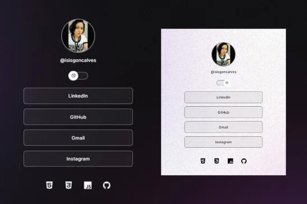

<h1 align="center"> Projeto Discover </h1>

Programa exclusivo e gratuito, promovido pela Rocketseat para ensino de tecnologias WEB.

<h2 align="center"> Autores </h2>

- [@isisgoncalves](https://www.github.com/isisgoncalves)

<h2 align="center"> Referência </h2>

 - [Rocketseat - Discover](https://www.rocketseat.com.br/discover)
 - [Mayk Brito](https://github.com/maykbrito)
 - [ReadMe](https://readme.so/pt)

<h2 align="center"> 🚀 Tecnologias </h2>

Esse projeto foi desenvolvido com as seguintes tecnologias:

- HTML
- CSS
- JavaScript
- Git e Github

## 💻 Projeto

Este é um projeto DevLinks. Um agregador de links para usar como cartão de visitas online.

- [Acesse o projeto finalizado, online](https://isisgoncalves.github.io/Projeto-Discover/)

## Continua...
